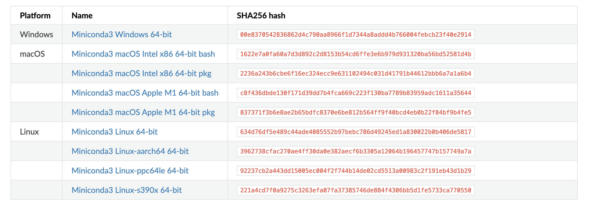
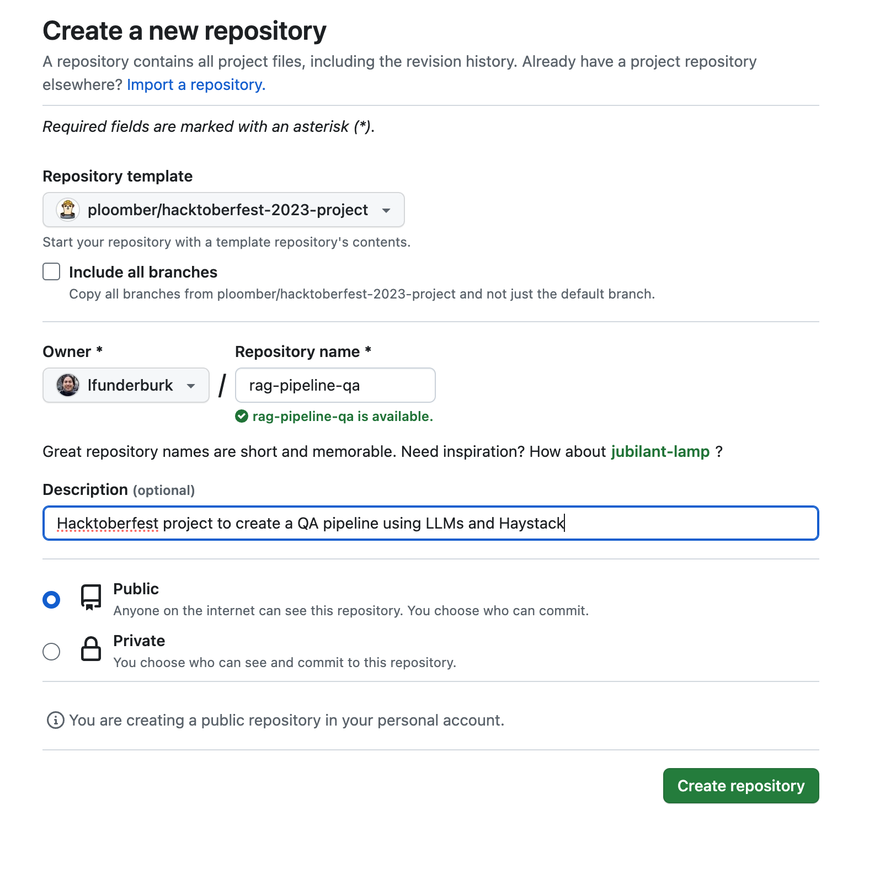
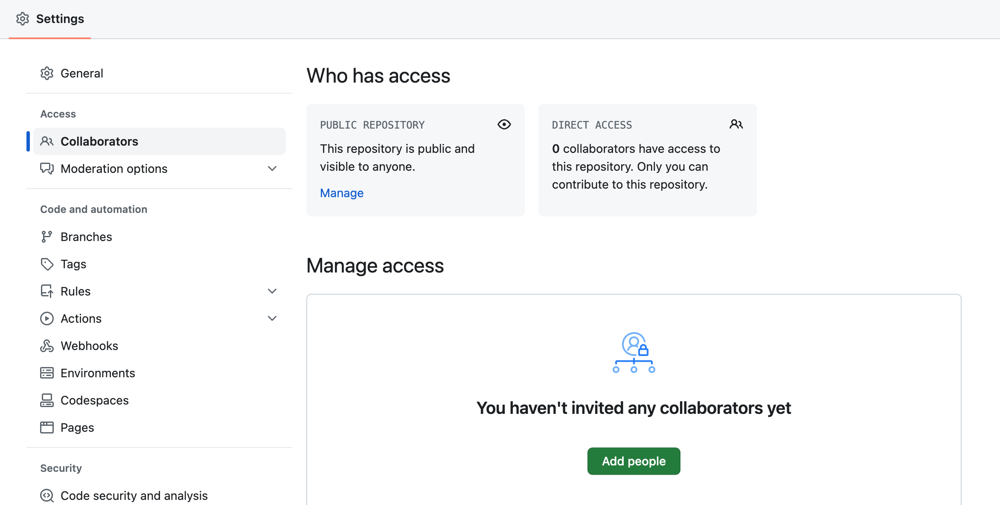
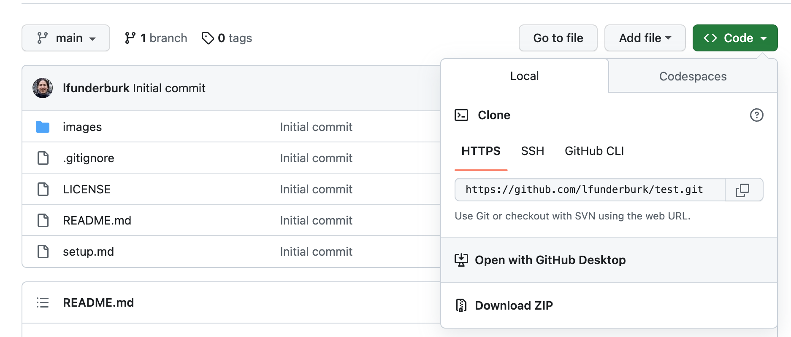

# Set up instructions

## :hammer_and_wrench: Tools We'll Be Using
We will be working with: 

1. `git`: Through GitHub Desktop and the command line to ensure we can collaborate on code
2. `conda`, and `poetry`: To manage our Python environments
3. Virtual Studio Code (VSCode): To write our code
4. Open source packages: Ploomber, JupySQL, Jupyter notebooks, FastAPI, Haystack and Chainlit
5. Docker: To containerize our applications

<p></p>

## :rocket: Software to install
Review the environment setup instructions for the local environment that you'll be using in this course.

<details>
<summary> Install GitHub Desktop</summary>

Source: https://desktop.github.com/

Click the `Download for {OS}` button.

</details>

<details>
  <summary>Github SSH Setup (if you are using Git from the terminal instead of GitHub Desktop)</summary>
  Secure Shell Protocol (SSH) provides a secure communication channel of an unsecured network.  Let's set it up!
  
  <p></p>

  1. Generate a Private/Public SSH Key Pair.
    
  ```console
  ssh-keygen -o -t rsa -C "your email address for github"
  ```

  2. Save file pair.  Default location `~/.ssh/id_rsa` is fine! 
  

  3. At the prompt, type in a secure passphrase.
  4. Copy the contents of the public key that we will share with GitHub. 

     * Mac: `pbcopy < ~/.ssh/id_rsa.pub` 

     * Windows (WSL): `clip.exe < ~/.ssh/id_rsa.pub`

     * Linux: `xclip -sel c < ~/.ssh/id_rsa.pub`
  
  5. Go to your GitHub account and go to `Settings`. 
  
  6. Under `Access`, click on the `SSH and GPG keys` tab on the left.

  


  7. Click on the `New SSH Key` button.
  
  

  
  8. Name the key, and paste the public key that you copied. Click the `Add SSH Key` button
  

  


</details>


<details>
  <summary>Install miniconda</summary>

Source: https://docs.conda.io/projects/miniconda/en/latest/#id2

Pick the distribution that makes sense for your OS.



</details>


<details>
  <summary>Install and set up VSCode</summary>

Source: https://code.visualstudio.com/docs/setup/setup-overview

Pick the distribution that makes sense for your OS.


  <summary>Install the Python and Jupyter Notebook Extensions</summary>

  1. Click the `Extensions`  tab on the left side of the window.

  2. Type "Python" in the search bar.

  3. Click `Install`   on both the <ins><strong>Python Extension</strong></ins> and on the <ins><strong>Microsoft Jupyter Notebook Extension</strong></ins>


</details>

<p> </p>

## Creating a local copy of the repository

**Each team will decide who will be the owner of the repository. The owner will create a copy of the repository and share access with the team members.**

1. Press on the `Use this template` button on the top right of the repository.
2. Select "Create a new repository" and populate the fields 



3. The owner of the repository will share the repository with the team members by collecting their GitHub IDs and adding them as collaborators.



4. Each team member will clone the repository to their local machine. You can use GitHub Desktop or the command line to clone the repository. 

To use GitHub Desktop, click on the `Code` button and select `Open with GitHub Desktop`.



If you prefer to use the command line, copy the SSH link and run the following command in your terminal.

```bash
git clone <SSH link>
```

## Setting up a virtual environment

Once you have installed all software required and have cloned the repository, you will need to set up a virtual environment. A virtual environment is a tool that helps to keep dependencies required by different projects separate by creating isolated python virtual environments for them. This is one of the most important tools that most of the Python developers use.

From GitHub Desktop, right click on the name of the repo, then click on the `Open in Visual Studio Code` button. This will open the repository in VSCode.


Once VSCode is open, open a new terminal by clicking on the `Terminal` menu, then selecting `New Terminal`.

Ensure your terminal is of type "bash" or "command-line" to run conda commands.


### Setting up a virtual environment using conda

1. Create a new conda environment using the following command. 

```bash
conda create -n hacktoberfest-env python=3.10
```

2. Activate the environment using the following command.

```bash
conda activate hacktoberfest-env
```

3. Install poetry. 

```bash
pip install poetry
```

4. Install the required packages using the following command.

```bash
poetry install
```

### Let's connect VSCode to the virtual environment we just created.

This assumes you are still working from the folder corresponding to the repository you just cloned.

1. Open the Command Pallette 
<strong>(Mac: </strong></ins> <kbd>Shift</kbd><kbd>⌘</kbd>+<kbd>P</kbd> 
,<strong> Windows: </strong></ins> <kbd>Ctrl</kbd>+<kbd>Shift</kbd>+<kbd>P</kbd>)

2. Type "Python Interpreter".

3. Click on `Python: Select Interpreter`

4. Select the `Conda` environment that you installed earlier (`hacktoberfest-env`)

<p align = "center" draggable=”false”>
 
</p>

5. Now you're ready to start coding!

## 🐳 Setting up Docker Desktop and Compose

<details>
  <summary>Windows</summary>


**👉 [💿 Download Docker](https://desktop.docker.com/win/main/amd64/Docker%20Desktop%20Installer.exe)** 👈

1. Double-click **Docker Desktop Installer.exe** to run the installer.

2. When prompted, ensure the **Use WSL 2 instead of Hyper-V** option on the Configuration page is selected or not depending on your choice of backend.

   If your system only supports one of the two options, you will not be able to select which backend to use.

3. Follow the instructions on the installation wizard to authorize the installer and proceed with the install.

4. When the installation is successful, select **Close** to complete the installation process.

5. If your admin account is different to your user account, you must add the user to the **docker-users** group. Run **Computer Management** as an **administrator** and navigate to **Local Users and Groups** > **Groups** > **docker-users**. Right-click to add the user to the group.
   Sign out and sign back in for the changes to take effect.
   
</details>


<details>
  <summary>Ubuntu</summary>

To install Docker Desktop successfully, you must:

- Meet the [system requirements](https://docs.docker.com/engine/install/ubuntu/#prerequisites)
- Have a 64-bit version of either Ubuntu Jammy Jellyfish 22.04 (LTS) or Ubuntu Impish Indri 21.10.
  Docker Desktop is supported on `x86_64` (or `amd64`) architecture.
- For non-Gnome Desktop environments, `gnome-terminal` must be installed:
  ```console
  $ sudo apt install gnome-terminal
  ```

1.  Update the `apt` package index and install packages to allow `apt` to use a
    repository over HTTPS:

    ```console
    $ sudo apt-get update
    $ sudo apt-get install ca-certificates curl gnupg
    ```

2.  Add Docker's official GPG key:

    ```console
    $ sudo install -m 0755 -d /etc/apt/keyrings
    $ curl -fsSL {}/gpg | sudo gpg --dearmor -o /etc/apt/keyrings/docker.gpg
    $ sudo chmod a+r /etc/apt/keyrings/docker.gpg
    ```

3.  Use the following command to set up the repository:

    ```console
    $ echo \
      "deb [arch="$(dpkg --print-architecture)" signed-by=/etc/apt/keyrings/docker.gpg] {} \
      "$(. /etc/os-release && echo "$VERSION_CODENAME")" stable" | \
      sudo tee /etc/apt/sources.list.d/docker.list > /dev/null
    ```

4. Update the `apt` package index:

   ```console
   $ sudo apt-get update
   ```


5. Download Docker Desktop
   
     ``` bash
     wget https://desktop.docker.com/linux/main/amd64/docker-desktop-4.22.1-amd64.deb
     ```

6. Install the package with apt as follows:
     ```bash
     $ sudo apt-get update
     $ sudo apt-get install ./docker-desktop-4.22.1-amd64.deb
     ```
     
7. Launch Docker Desktop
     ```bash
          systemctl --user start docker-desktop
     ```
     
   > **Note**
   >
   > At the end of the installation process, `apt` displays an error due to installing a downloaded package. You
   > can ignore this error message.
   >
   > ```
   > N: Download is performed unsandboxed as root, as file '/home/user/Downloads/docker-desktop.deb' couldn't be accessed by user '_apt'. - pkgAcquire::Run (13: Permission denied)
</details>


<details>
  <summary>macOS (Intel and Apple Silicon)</summary>

**👉 [💿 Download Docker](https://desktop.docker.com/mac/main/arm64/Docker.dmg)** 👈

1. Double-click `Docker.dmg` to open the installer, then drag the Docker icon to
    the **Applications** folder.


2. Double-click `Docker.app` in the **Applications** folder to start Docker.

3. The Docker menu () displays the Docker Subscription Service Agreement.

    

4. Select **Accept** to continue. 

   Note that Docker Desktop won't run if you do not agree to the terms. You can choose to accept the terms at a later date by opening Docker Desktop.

   For more information, see [Docker Desktop Subscription Service Agreement](https://www.docker.com/legal/docker-subscription-service-agreement). We recommend that you also read the [FAQs](https://www.docker.com/pricing/faq).
5. From the installation window, select either: 
   - **Use recommended settings (Requires password)**. This let's Docker Desktop automatically set the necessary configuration settings. 
   - **Use advanced settings**. You can then set the location of the Docker CLI tools either in the system or user directory, enable the default Docker socket, and enable privileged port mapping. See [Settings](../settings/mac.md#advanced), for more information and how to set the location of the Docker CLI tools.
6. Select **Finish**. If you have applied any of the above configurations that require a password in step 5, enter your password to confirm your choice.
</details>

## 🔑 Bonus: Setting Up Keys and Tokens


<details>
  <summary>Generating an OpenAI API key</summary>
     
**Create an account with OpenAI [here](https://platform.openai.com/signup) if you do not have one.**

Navigate to [OpenAI's API Developer settings](https://platform.openai.com/account/api-keys) and click on `+ Create new secrete key`.


Name your key and click `Create secret key`


Copy the key and save it for later use. We will use this key several times in deploying projects. Please do not lose this key or you will need to generate a new one


We recommend your run through our [OpenAI Notebook](https://colab.research.google.com/drive/16Y67VozkGVErtrF3WQArpM52AOk5pBGu?usp=sharing#scrollTo=3qCKaH6vD-jZ) to learn how to utilize the OpenAI API.
</details>

<details>
  <summary>Generating a Huggingface Access Token</summary>
     
**Create an account with Huggingface [here](https://huggingface.co/join) if you do not have one.**

Navigate to [Token settings](https://huggingface.co/settings/tokens) and click on `New token`.


Name your access token, change the role to write, and click `Generate a token`


Copy the token and save it for later use. We will use this token several times in deploying projects. If you lose this token, you can always go back to your token's page and view the token.


Login to Huggingface using your terminal
``` bash
huggingface-cli login
```


After logging in, press `y` to add the token to credentials for git.


</details>

